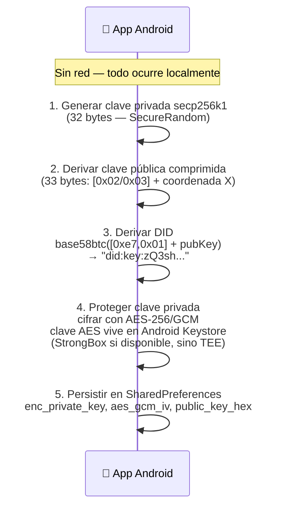
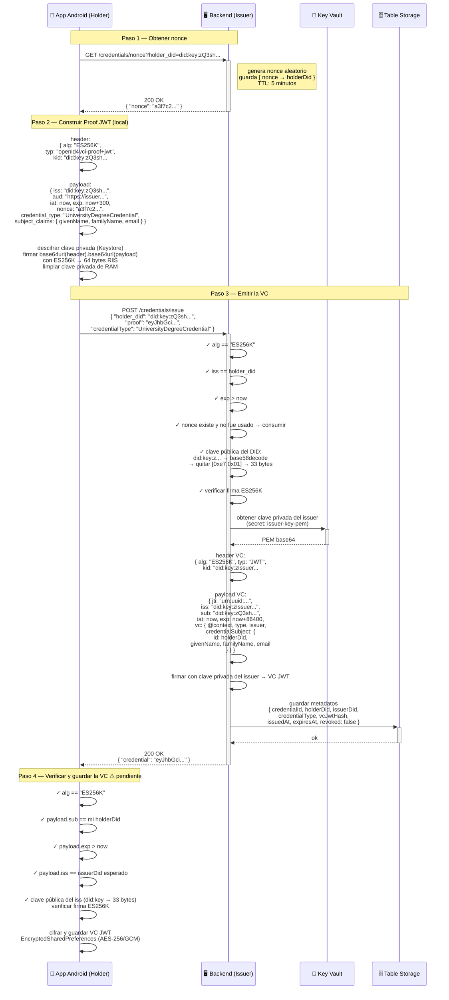
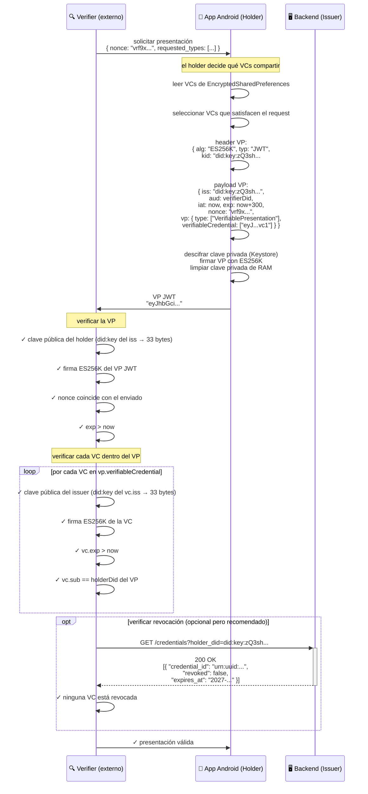
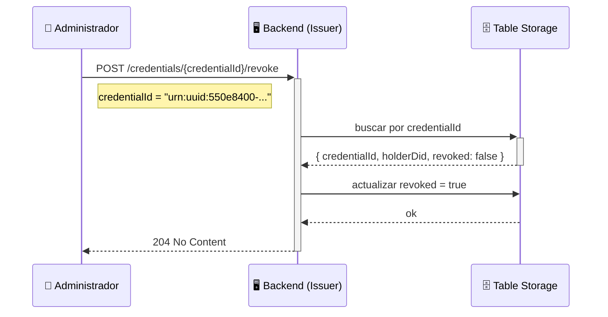
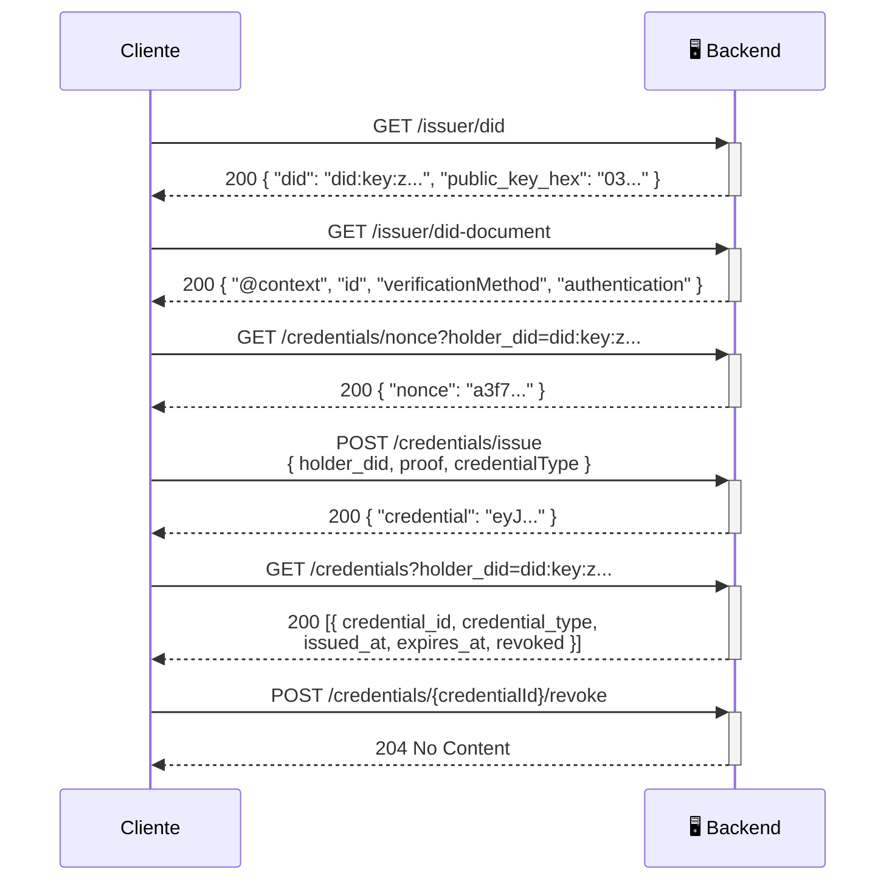

# Flujos del sistema

Diagramas de secuencia: dispositivo Android ↔ backend ↔ servicios Azure.

---

## 1. Generación de identidad del holder

Ocurre **una sola vez** en el dispositivo, sin red.

> La clave privada nunca existe en claro en disco. El DID es la clave pública codificada — no requiere registro externo.

---

## 2. Emisión de Verifiable Credential

> ⚠️ El paso 4 (verificación en el dispositivo) está pendiente de implementar en `CredentialService.java`.
> El issuer guarda solo el hash SHA-256 del JWT — nunca el JWT completo. El holder es el único custodio.

---

## 3. Presentación ante un Verificador

> El verifier resuelve la clave del issuer directamente desde su `did:key` — sin contactarlo.
> El holder controla qué VCs incluye en cada presentación.

---

## 4. Revocación de una VC

> El JWT en el dispositivo del holder no se modifica — la firma del issuer sigue siendo válida.
> El cambio está solo en el registro del backend. Los verifiers que consulten `/credentials` verán `revoked: true`.

---

## 5. Endpoints — referencia rápida

